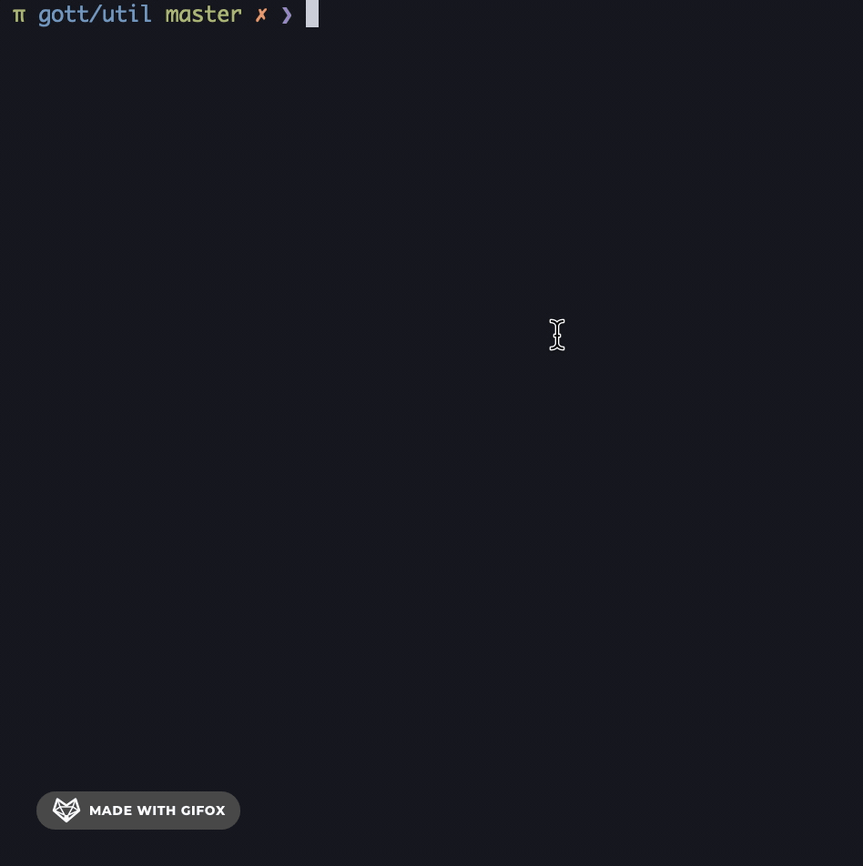

# Gott

<a href="https://996.icu"></a>
[](https://github.com/996icu/996.ICU/blob/master/LICENSE)

可视化指定固定单测执行的命令行工具

## Demo



## Install

go version >= 1.17，git clone 当前 repo 并执行 `go build` 即可，或是直接使用下方命令：

```sh
go install github.com/sshelll/gott@latest
```

go version <= 1.16 可前往 Github Release 页面下载打包好的可执行文件(MacOS Only)

## Usage

**在任意目录下直接使用 `gott` 来替换 `go test` 即可**

或者使用 `gott -p` 来获取单测名称但不执行 `go test`

例如:

`go test -v` => `gott -v`

`go test -v -race` => `gott -v -race`

`go test -gcflags="all=-l -N"` => `gott -gcflags=\"all=-l -N\"`

`go test -gcflags=all=-l -race -coverprofile=coverage.out` => `gott -gcflags=all=-l -race -coverprofile=coverage.out`

`gott -p` => `you will get a go test func name`

**使用以下脚本可以配合 dlv 实现 debug 指定单测:**

```sh
#!/bin/zsh

fn=$(gott -p)

if [ ! $fn ]; then exit 0; fi

dlv test --build-flags=-test.run $fn
```

## QA

- Q1：是否支持识别 `github.com/stretchr/testify/suite` ？

  A1：支持，但是对于 suite 的入口方法有一定的限制，如下。

  ```go
  type FooTestSuite struct {
    suite.Suite
  }

  // OK, allow 'new'
  func TestFoo1(t *testing.T) {
    suite.Run(t, new(FooTestSuite))
  }

  // OK, allow '&'
  func TestFoo2(t *testing.T) {
    suite.Run(t, &FooTestSuite{})
  }

  // not OK
  func TestFoo3(t *testing.T) {
    foo := new(FooTestSuite)
    suite.Run(t, foo)
  }

  // not OK
  func TestFoo4(t *testing.T) {
    m := make(map[int]interface{})
    m[1] = &FooTestSuite{}
    suite.Run(t, m[1])
  }
  ```

- Q2：菜单常用按键映射？

  A2：`↑` `↓` 键移动光标，`/` 键进入搜索模式（搜索用的是普通的 substr 算法），`esc` 键退出。
